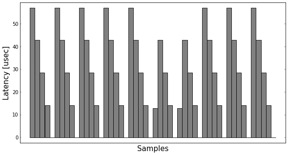

RT Test
=======

# Overview
RT Test is a latency detection program used to evaluate the real-time performance of an embedded device. 
It collects a specific amount of samples in a user-defined time period and provides statistics about the overall latency, 
It is similar to [cyclictest](https://wiki.linuxfoundation.org/realtime/documentation/howto/tools/cyclictest), although more limited.

To execute the program, run: 
`$ make` 
`$ sudo ./rt_test [cycle_time] [number_of_cycles]`

# Real-Time Linux
The normal Linux distribution does not offer **hard** real-time capabilities. 
In order to achieve those, a real-time preemption patch (*RT-PREEMPT*) is applied to the Linux kernel.

#### Performance
The overall performance of the OS is degraded, but **determinism** (predictability) is provided. 
In contrast to a normal OS that uses soft real-time, the average error (throughput) is increased, but the maximum error (predictability) is decreased. 
This means that *throughput is not the top priority* of the OS, and will be sacrificed if needed.

#### RT-PREEMPT Patch
For resources about building and configuring the real-time kernel, see [this](https://wiki.linuxfoundation.org/realtime/documentation/howto/applications/preemptrt_setup) page. 
For information on how to build a real-time application, see [this](https://wiki.linuxfoundation.org/realtime/documentation/howto/applications/application_base) page.

#### Platform
This program is aimed at devices running real-time Linux. 
For experimental purposes, it was run on a **BCM2837** board (Raspberry Pi 3). 
The board is comprised of a quad-core ARM Cortex-A53 (ARMv8 architecture), running on 1.2 GHz, with 1GB RAM (power consumption is around 800 mA). 
The hosting OS is a Linux flavor, specific to RPi, called Raspbian. 
The tests run on a 4.4.34 Linux kernel.

# Implementation
In order to collect all timestamps and provide latency statistics, a **cyclic executive task** is created on a separate thread that runs on a user-defined cycle time. 
At the start of every iteration of the sampling process, the cycle time is added to the task's timer. After the sampling is done, the task sleeps for the remaining of the time before starting a new iteration.

A scheduler **statistics module** was created in order to monitor the performance of the system during the sampling. It monitors the average, minimum and maximum latency errors during a test run. 
Each time a sample is collected, these statistics are updated with regard to the previous sample.

# Tests & Results
In order to evaluate the magnitude of the latency, two experiments were carried out on the embedded system. 
Below are the plots of the latency of every sample (with respect to its previous sample) for every experiment. 
The statistics of every run are also provided.

1. Cycle time of 10 ms. 
Average Error: 06.12 us 
Min Error: 00.02 us 
Max Error: 72.58 us

2. Cycle time of 100 ms. 
Average Error: 14.82 us 
Min Error: 00.02 us 
Max Error: 66.02 us
 

# Problems & Improvements
Since the user can define the number of samples to be collected by the test program with an argument, the required **memory is allocated on runtime**. 
A way to avoid this would be for the user to define the desired number of samples at compile-time.  
Static allocation should be, in general, preferred in an embedded system. 
If the application is safety-critical, dynamic allocation should be avoided at all costs, since an allocation failure could be catastrophic. 
    

*Dimitrios Panagiotis G. Geromichalos* 
*August, 2017*